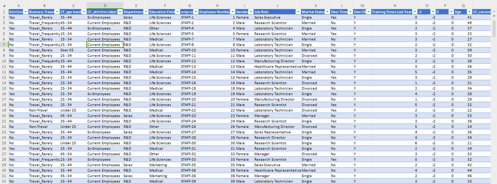
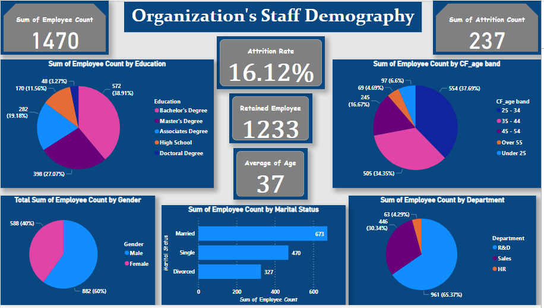
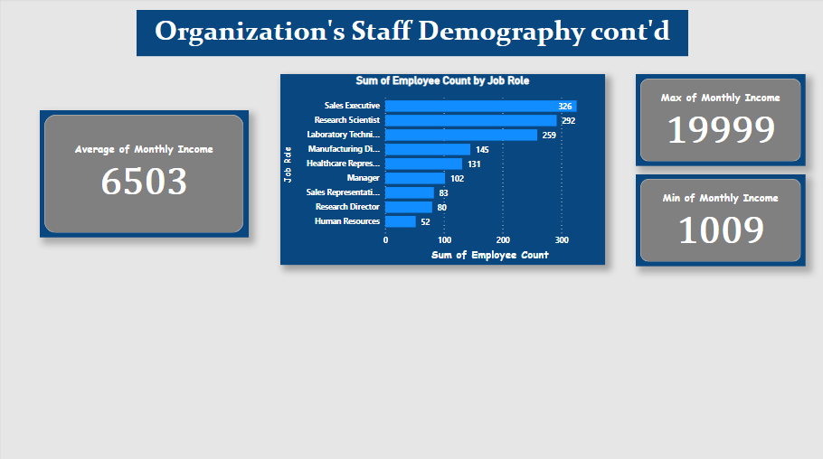

# HR DATA ANALYTICS
This is a very robust and concise data analysis of an organization of over 1,470 staffs with different indicators to work with and arriving at data-informed conclusions from the trends and patterns noted in the data.

## DOCUMENTATION OUTLINE

- [Project Overview](#project-overview)

- [Project Objectives](#the-project-objectives)

- [Data Sources](#data-sources)

- [Tools Used for Analysis](#tools-used-for-analysis)

- [Data Cleaning, Preparation and Transformation](#data-cleaning-preparation-and-transformation)

- [Observations and Results](#observations-and-results)

- [Recommendations](#recommendations)

- [Contact Info](#contact-info)

## Project Overview
This project is to tell a story on attrition based on employee statistics and analyze various metrics related to the
workforce, such as employee attrition, performance rating, job satisfaction, etc.

## The Project Objectives
Demographics- this summarizes employee statistics such as age group, gender, marital status, etc.

Employees approval and job ratings- provides insights to performance ratings, job satisfactions, work life balance, etc.

Attrition Analysis -  shows employee attrition by job roles, departments, years in current role, etc.
attrition across all the relevant metrics possible.

## Data Sources
The data was provided by the SkilHarvest Data Analysis Instructor in xlsx format.
Data consisted of 1470 rows and 41 columns; totals 60270 an organization staff data just from the raw data

## Tools Used for Analysis
- Ms Excel for Data Cleaning [Download Here](https://www.microsoft.com/en-us/microsoft-365/excel)
- MS Power BI for Report & Visualization [Download Here](https://powerbi.microsoft.com/en-us/downloads/)
- MS Powerpoint for presentation [Download Here](https://www.microsoft.com/en/microsoft-365/powerpoint)
  
## Data Cleaning, Preparation and Transformation

## Observations and Results

- ### DEMOGRAPHIC
This is basically a descriptive analysis of the staff demographic of the organization.

- Total number of employees is 1,470 and 1,233 are actively retained staffs.
- The Attrition Count is 237 employees; that is 237 staffs have left the company.
- The Attrition Rate is 16.12%.
- The average age of staffs is 37; that is to say the workforce is considerably very young.
- The organization has 3 Departments with 9 different job roles.
- The average monthly income for employees is $6,503; The least paid staff receives $1,009 and most paid staff receives $19,999 as monthly income.

---
- - - #### Gender
- The organization has 882 males and 588 females; The males accounts for 60% while females accounts for 40% of the employee count.

- - - #### Marital Status
- The organization has 673 married staffs which accounts for 45.8% of employee count.
- 470 single staffs which accounts for 40% of employee count and;
- 327 Divorced staffs which accounts for 22.2% of employee count.
- - - #### Age Group
 The Organization was grouped into 5 age groups;
- Under 25: has 97 staffs which accounts for 6.6%
- 25-34: has 554 staffs which accounts for 37.69%: turns out to have highest number of the staffs.
- 35-44: has 505 staffs which accounts for 34.35%: second most populated number of staffs; closely behind the foremost group
- 45-54: has 245 staffs which accounts for 16.67%
- over 55: has 69 staffs which accounts for 4.69%: has the least number of staffs.

- - - #### Education Level
The organization has employees with 5 different education degree levels;
- High School: has 170 staffs which is 11.56% of the staffs
- Associates Degree: has 282 staffs which is 19.18% of the staffs.
- Bachelor's Degree: has 572 staffs which is 38.91%; Bachelor's Degree has the most number of staffs in the organization 
- Master's Degree: has 398 staffs which is 27.07% of the staffs
- Doctoral Degree: has 48 staffs which is 3.27% of the staffs

- - - #### Department at work
The organization has 3 departments, namely:
- R&D: This department has 961 staffs which is 65.37% of the staffs; These Department has the most number of staffs
- Sales: This department has 446 staffs which is 30.34% of the staffs 
- HR: This department has 63 staffs which is 4.29% of the staffs.

- - - #### Job Roles

- The organization has 9 job roles, namely;
- Sales Executive: has 326 staffs which is 22.18% of the employees.
- Research Scientist: has 292 staffs which is 19.86% of the employees.
- Laboratory Technician: has 259 staffs which is 17.62% od the employees.
- Manufacturing Director: has 145 staffs which is 9.86% of the employees.
- Healthcare Representative: has 131 staffs which is 8.91% of the employees.
- Manager: has 102 staffs which is 6.94% of the employees.
- Sales Representative: has 83 staffs which is 5.65% of the employees.
- Research Director: has 80 staffs which is 5.44% of the employees.
- Human Resources: has 52 staffs which is 3.54% of the employees.

- - - #### Monthly Income
According to the data analysis carried out;
The average monthly income for employees is $6,503; The least paid staff receives $1,009 and most paid staff receives $19,999 as monthly income.

-  ### EMPLOYEES APPROVAL AND JOB RATINGS
  This is primarily diagnostic analytics of the data whereby we examine data to understand the causes of past events using some indicators within the dataset.

- - - #### Job Satisfaction 
The Job satisfaction was scaled as 1,2,3 & 4 on the data; 1 been the lowest and 4 been the highest, so I Iterated it to understandable scale as follows;
- 1= Poor Job Satisfaction
- 2= Mild Job Satisfaction
- 3= Good Job Satisfaction
- 4= Excellent Job Satisfaction
- So therefore we had the following Data;

- Poor Satisfaction: 289 staffs were unsatisfied with their job.This was 19.66%
- Mild Satisfaction: 280 staffs were mildly unsatisfied with their job.This was 19.05% of the employees.
- Good Satisfaction: 442 staffs were quite satisfied with their job. This was 30.07% of enployees.
- Excellent Satisfaction: 459 staffs were very satisfied with their job.This was 31.22% of the employees.
- So therefore 61.22% of the employees were satisfied and a staggering 38.71% were unsatisfied with their job.

- - - #### Environment Satisfaction.

Environment Satisfaction was scaled as 1,2,3 & 4 on the data; 1 been the lowest and 4 been the highest, so I Iterated it to understandable scale as follows;
- 1= Poor Environment Satisfaction
- 2= Mild Environment Satisfaction
- 3= Good Environment Satisfaction
- 4= Excellent Environment Satisfaction.
- So therefore we had the following Data;

- Poor Satisfaction: 284 staffs were unsatisfied with their work environment. This was 19.32% of employees.
- Mild Satisfaction: 287 staffs were mildly unsatisfied with their work environment. This was 19.52% of employees.
- Good Satisfaction: 453 staffs were quite satisfied with their work environment. This was 30.82% of employees.
- Excellent Satisfaction: 446 staffs were very satisfied with their work environment. This was 30.34% of employees.
- So therefore 61.16% were satisfied and an alarming 38.84% were unsatisfied with their work environment 

- - - #### Relationship Satisfaction 
Relationship Satisfaction was scaled as 1,2,3 & 4 on the data; 1 been the lowest and 4 been the highest, so I Iterated it to understandable scale as follows;
- 1= Poor Relationship Satisfaction
- 2= Mild Relationship Satisfaction
- 3= Good Relationship Satisfaction
- 4= Excellent Relationship Satisfaction 
- So therefore we had the following Data;

- Poor Satisfaction: 276 staffs were unsatisfied with their relationship. This was 18.78% of employees.
- Mild Satisfaction: 303 staffs were mildly unsatisfied with their relationship. This was 20.61% of employees.
- Good Satisfaction: 459 staffs were quite satisfied with their relationship. This was 31.22% of employees.
- Excellent Satisfaction: 432 staffs were very satisfied with their relationship. This was 29.39% of employees.
- So therefore 60.61% were satisfied and an alarming 39.39% were unsatisfied with their relationship 

- - - #### Job Involvement

Job Involvement was scaled as 1,2,3 & 4 on the data; 1 been the lowest and 4 been the highest, so I Iterated it to understandable scale as follows;
- 1= Very Low Job Involvement 
- 2= Below Average Job Involvement
- 3= Above Average Job Involvement
- 4= Very High Job Involvement
- So therefore we had the following Data;

- Very Low: 83 staffs were poorly involved with their job. This was 5.65% of employees.
- Below Average: 144 staffs were poorly involved with their job. This was 9.8% of employees.
- Above Average: 375 staffs were involved in their jobs. This was 25.51% of employees.
- Very High: 868 staffs were involved in their job. This was 59.05% of employees.
- So therefore 84.56% were involved in their job and an alarming 15.44% were poorly involved in their job.

- - - #### Job Performance Rating

Job Performance Rating was scaled as 3 & 4 on the data; 3 been the least rating and 4 been the highest rating, yet so closely identified on the data; so I Iterated it to understandable scale as follows;
- 3= Okay Performance Rating
- 4= High Performance Rating
- So therefore we had the following Data;
  
- Okay: 1244 staffs had okay performance rating. This was 84.63% of employees.
- High Performance: 226 staffs had high performance rating. This was 15.37% of employees.

- - - #### Work Life Balance

Work Life balance was scaled as 1,2,3 & 4; 1 been the lowest and 4 been the highest, so I Iterated it to understandable scale as follows;
- 1= Very Poor Work-Life Balance
- 2= Poor Work-Life Balance
- 3= Good Work-Life Balance
- 4= Excellent Work-Life Balance
- So therefore we had the following Data;

- Very Poor: 80 staffs had very poor work life balance. This was 5.44% of employees.
- Poor: 344 staffs had very poor work life balance. This was 23.40% of employees.
- Good: 893 staffs had very poor work life balance. This was 60.75% of employees.
- Excellent: 153 staffs had very poor work life balance. This was 10.41% of employees.
- So therefore 71.16% had good work life balance and 28.84% had poor work life balance.

- ### ATTRITION ANALAYSIS
  This is a detailed breakdown of attrition across all the metrics available in the data and to extract insights from this patterns established, this is both diagnostic and predictive analysis of the attrition of staffs.

  

## Recommendations

## Contact Info
Feel free to reach out to me via email at adelekedavid77@gmail.com or to connect with me on [LinkedIn](http://www.linkedin.com/in/adeleke-davido) for any inquiries & collaboration 

Let's dive into the world of data together and uncover valuable insights!

